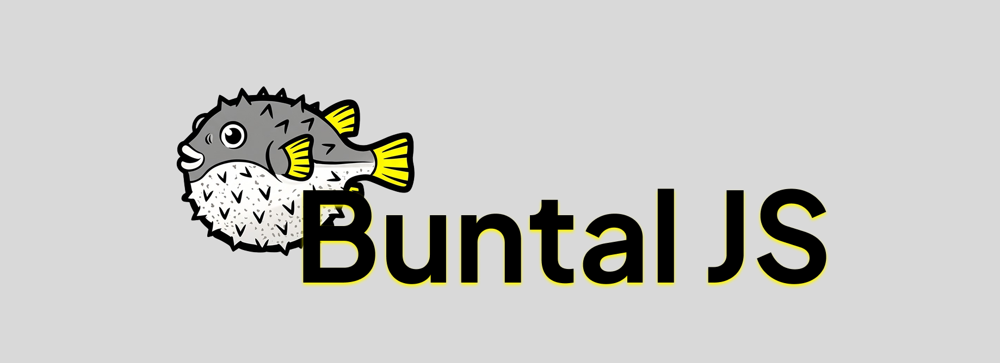

<section align="center">
  
  Early Development Stage
<section>
 
<section>
  
</section>
 
<section align="center">
  <a href="https://buntaljs.org" target="_blank">
    Website
  </a>
   &nbsp;&middot; &nbsp;
  <a href="https://docs.buntaljs.org" target="_blank">
    Docs
  </a>
</section>
 
<section align="left" markdown="1">
Ultra-lightweight type-safe modern web framework with TypeScript, React and Bun. Create HTTP servers and/or web apps without unnecessary bloatware.
</section>
